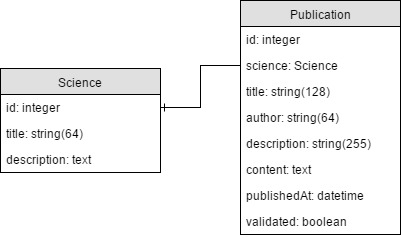
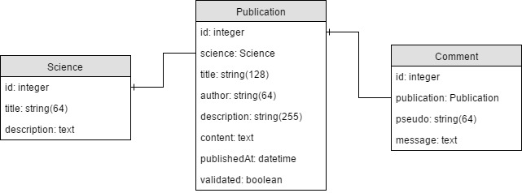

ekyn-learn/sf-scipub
=========

## Création d'une plate-forme de publication de travaux scientifiques.

Les scientifiques désireux de publier sur notre site auront à leur disposition 
un formulaire de saisi afin de nous soumettre leur travaux (publication).

Un espace d'administration permettra à nos modérateurs :
- la gestion des sciences (catégories de publication).
- la gestion des publications (notamment de valider celles soumises 
  par les scientifiques en partie publique).

La partie publique présentera les publications validées, catégorisées par sciences.

### Démarrage

Cloner ce dépôt

      git clone https://github.com/ekyna-learn/sf-scipub.git

Installer les dépendances

      cd sf-scipub
      composer install

### Partie 1   

1. Créer les entitées *Science* et *Publication*. Vous pourrez ensuite charger 
   les données de test à l'aide la commande ```php bin/console hautelook:fixtures:load```.

    

2. Développer la partie publique en utilisant les resources fournies par notre 
   intégrateur/designer.

    Ces resources sont situées dans le dossier *integration* à la racine du projet.

    - **Page d'accueil** ( */* ) : afficher les 3 dernières publications (d'après la 
      date de publication). Un lien sur le titre permettra d'accéder à la page détail 
      de la publication.
    - **Sciences** ( */sciences* ) : afficher la listes des sciences, par ordre 
      alphabétique. Un lien sur le titre permettra d'accéder à la page détail de 
      la science.
    - **Science** ( */sciences/[id-science]* ) : afficher le détail de la science, 
      et la liste des publications associées.
    - **Publication** ( */sciences/[id-science]/[id-publication]* ) : afficher le 
      détail de la publication.
    - **Publier** ( */publier* ) : afficher un formulaire permettant aux scientifiques 
      de nous soumettre leur publication. 

3. Mettre en place une validation des données (Validator component).

### Partie 2

1. Modifier la mise en page de la partie publique : dans les pages détail **Science** 
   et **Publication**, afficher une '*sidebar*' présentant la liste des sciences sous 
   forme de liens vers les pages détail **Science** respectives. 

2. Créer un service (DI) de notification (App\Service\Notifier). Lors de la soumission 
   d'une nouvelle publication par un scientifique, appeler la méthode *notify()* de ce 
   service pour informer les modérateurs (notification par email). 

### Partie 3

La gestion des sciences et des publications mise en place, nous souhaitons donner la 
possibilité aux internautes de commenter les publications.

1. Créer l'entité Commentaire et l'associer aux publications.

    

2. Ajouter un formulaire de saisie de commentaire dans la page détail **Publication** 
   de la partie publique.

3. Afficher la liste des commentaires entre le détail de la publication et 
   le formulaire de saisie de commentaire.

### Partie 4

1. Développer la partie administration.
   
   Une intégration HTML/CSS est disponible comme base dans le dossier *integration/admin*.

   | URL | Description |
   | --- | --- |
   | /admin/sciences | Liste des sciences |
   | /admin/sciences/create | Formulaire de création d'une nouvelle science |
   | /admin/sciences/[id] | Détail de la science |
   | /admin/sciences/[id]/update | Modification de la science |
   | /admin/sciences/[id]/delete | Suppression de la science |
   | /admin/publications | Liste des publications |
   | /admin/publications/create | Formulaire de création d'une nouvelle publication |
   | /admin/publications/[id] | Détail de la publication |
   | /admin/publications/[id]/update | Modification de la publication |
   | /admin/publications/[id]/delete | Suppression de la publication |
   | /admin/comments | Liste des publications |
   | /admin/comments/create | Formulaire de création d'un nouveau commentaire |
   | /admin/comments/[id] | Détail du commentaire |
   | /admin/comments/[id]/update | Modification du commentaire |
   | /admin/comments/[id]/delete | Suppression du commentaire |

2. Développer la modération des commentaires. 
Ajouter une propriété **validated** (initialisée à *false*) à l'entité **Comment**.  
Modifiez la gestion des commentaires en administration pour les modérateurs puissent valider les commentaires.
Dans la partie publique, n'afficher que les commentaires validés.

3. Sécuriser la partie administration avec le compte suivant :
   - Utilisateur  : **sciAdmin**
   - Mot de passe : **e=mc2**
